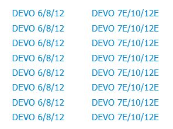

# DeviationTX

DeviationTX是一套开源RC遥控器实现，官方网站 [https://www.deviationtx.com](https://www.deviationtx.com/)。Deviation支持多种硬件类型，主要是 Walkera（华科尔） Devo 系列的遥控器，下面是官方网站列出的硬件列表：

目前我手上已经有遥控器了，但是没有办法二次开发，基于开源的可以做很多的定制开发，所以我决定DIY一个遥控器出来。

对Deviation TX支持的多种硬件，从功能上看每个遥控器都能满足使用，但是界面上看，DEVO8显示效果最好，支持彩色显示、支持触摸屏，Deviation 介绍如下：

所以我决定，**本次DIY的硬件就选择DEVO8**。

网络上很难找到 DEVO8 的原理图，费了好大劲才找到一个 devo10 的硬件板图，参考下图：

最后没办法，只能根据 Deviation 的源码来推测原理图。

> 特别声明：本文部分资料源自 https://www.deviationtx.com，如有需要请参考官方网站。

# 硬件选型

## MCU

DEVO-8使用的MCU是  STM32F103VCT6，淘宝上一搜一大堆，我手上还有两片存货，所以也不用买了。

## LCD

LCD也是库存，之前有一个2.4寸的并口液晶显示屏，驱动IC是ILI9341：

显示屏参数如下:

接口定义：

本次可以直接使用此屏了。

## 无线模块

现在应用最为广泛基本上就是nrf24L01模块了，由于是发射器，功率最好大一点，选择了带有PA+LNA的24L01模块：

淘宝上卖的都是通用模块，哪家的都差不多。

## 遥控器外壳

本次是DIY遥控器，自己做外壳太麻烦了，所以可以到网上找个差不多的遥控器改装。本次是测试用，满足功能要求即可，对外壳没有太多要求，这个是本次DIY用的外壳：

# 硬件设计

航模遥控器最麻烦的地方是其硬件比较繁琐，除了两个摇杆外，还有很多按钮、开关，在开始硬件设计之前需要将这些信息获取到。网上很难找到DEVO-8的外形图，于是就拿DEVO-10来举例吧。

航模遥控器分为左手油门和右手油门，使用哪个完全看个人习惯，他们的区别就在于油门位置不同。

**右手油门（日本手）**定义如下：

**左手油门（美国手）**定义如下：

硬件设计需要考虑涵盖上述主体功能。

最终，本次实现考虑支持的按钮如下图（红框范围内是本次支持的按钮，6通道遥控器）：

原版遥控器中有一系列的D/R按钮，用于调整数据输出方向，做成按钮感觉很容易误触发，所以本次直接做到软件中，软件界面提供D/R选择选项。

DEVO-8不支持电位器输出，本次考虑加上去，增加AUX5。

## 原理图

完整的原理图参考 Github： https://github.com/psbec/DeviationTX-Hardware 。

### 功能接口

下图包含两个摇杆和一个电位器输入：

下面是三段式开关和GEAR开关键：

下面是本次使用到的按键，按键使用的扫描方案，这样可以大大减少IO的占用：

下面是微调开关（*画PCB时将左右搞反了*）：

最后一个是USB，支持Micro USB座子的同时，将USB线引出，方便外接：

### LCD接口

我手上的LCD买的比较早，是37Pin的接口（pin间距0,8mm），如果直接焊接在板子上比较好用：

但是本次改造的这个航模遥控器，PCB板与LCD距离会比较远，最好使用FPC软线连接。考虑到很多LCD都是40pin接口的，本次LCD接口使用40Pin的FPC软线接口。为了把手上这块LCD用起来，就需要一个37Pin到40Pin的转换接头，如下图：

LCD使用的是16位并口线，MCU接口如下：

## PCB

PCB的尺寸需要与遥控器外壳匹配，下面是CAM350导出的图。

正面PCB图，绿色框中的是LCD 37pin到40pin的转换板，一起做到同一张PCB里面了，使用时可以切割下来用：

反面PCB图：

# 成品实物图

## 内部电路板

正面实物图（手工焊接，MCU旁边都是松香痕迹，有点脏）：

图中的8个按键对应了8个微调开关，位于摇杆的侧面和下面；主板通过FPC软线与LCD连接。

背面接线图：

所有的摇杆、开关、电位器均通过接插件与主板连接；最上方绿框内的是nrf24L01模块，用于与接收端通讯。

无线模块特写图（未安装天线）：

按键直接用面包板定制了，LCD和按键直接使用热熔胶固定在遥控器外壳上，有问题可以用热风枪吹下来：

## 整体外观

制作好的遥控器外形如下图，左上角和右上角分别增加了一个三档模式开关 MIX 和 FMOD，遥控器下方的开关改造成LCD显示屏和按键：

上图中遥控器未与接收端连接，信号栏显示不可用。

下面是与接收端连接后，信号栏满格（红框）：

目前测试功能正常。
