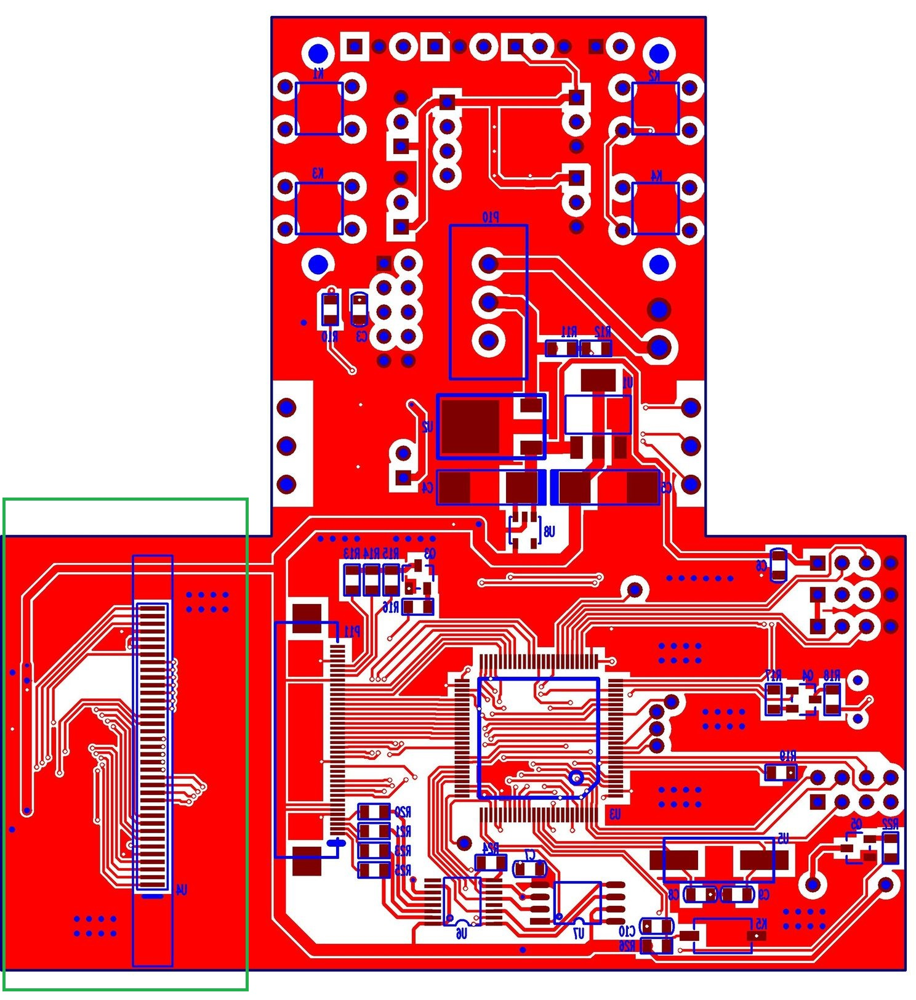

# DeviationTX

特别声明：本文参考资料源自 https://www.deviationtx.com，如有需要请参考官方网站。

Deviation是一套开源RC遥控器实现，支持多种硬件，官方网站介绍的有如下硬件列表：

基于开源的可以做很多的定制开发，所以我决定DIY一个遥控器出来。

对Deviation TX支持的多种硬件，从功能上看每个遥控器都能满足使用，但是界面上看，DEVO8显示效果最好，支持彩色显示、支持触摸屏，Deviation 介绍如下：

所以我决定，**本次DIY的硬件就选择DEVO8**。

# 硬件选型

## MCU

DEVO-8使用的MCU是  STM32F103VCT6，价格在20块左右，淘宝上一搜一大堆。

我手上还有两片库存，所以也不用买了。

## LCD

LCD我选择了2.4寸的并口液晶显示屏，驱动IC是ILI9341：

显示屏参数如下:

接口定义：

我买的时候价格很便宜，现在价格高了点，不过也是在20块钱以内。

## 无线模块

现在应用最为广泛基本上就是nrf24L01模块了，由于是发射器，功率最好大一点，选择了带有PA+LNA的24L01模块：

淘宝上卖的都是通用模块，哪家的都差不多。

## 遥控器外壳

到网上找个差不多的遥控器改装，本次是测试用，满足功能要求即可，对外壳没有太多要求：

# 硬件设计

航模遥控器最麻烦的地方是其硬件繁琐，除了两个摇杆外，还有很多按钮、开关，在开始硬件设计之前需要将这些信息获取到。网上很难找到DEVO-8的外形图，于是就拿DEVO-10来举例吧。

航模遥控器分为左手油门和右手油门，使用哪个完全看个人习惯，他们的区别就在于油门位置不同。

**右手油门（日本手）**定义如下：

**左手油门（美国手）**定义如下：

硬件设计需要考虑涵盖上述主体功能。

最终，本次实现考虑支持的按钮如下图（红框范围内是本次支持的按钮）：

原版遥控器中有一系列的D/R按钮，用于调整数据输出方向，做成按钮感觉很容易误触发，所以本次直接做到软件中，软件界面提供D/R选择选项。

DEVO-8不支持电位器输出，本次考虑加上去，增加AUX5。

## 原理图

完整的原理图参考 https://github.com/psbec/DeviationTX-Hardware 。

### 功能接口

功能接口部分主要是上述的功能按键，下图包含两个摇杆和一个电位器输入：

下面是三段式开关和GEAR开关键：

下面是本次使用到的按键，按键使用的扫描方案，这样可以大大减少IO的占用：

下面是微调开关（*画PCB时将左右搞反了*）：

最后一个是USB，支持USB座子的同时，引出4根线，方便外接：

### LCD接口

我这LCD买的比较早，是37Pin的接口，实际使用时会发现极不方便，所以本次设计LCD使用40Pin的FPC软线接口，这样就需要一个37Pin到40Pin的转换接头，如下图：

LCD使用的是16位并口线，MCU接口如下：

## PCB

PCB的尺寸需要与遥控器外壳匹配，下面是CAM350导出的图：

正面PCB图：

反面PCB图：

这里将LCD转接板和控制器主板画在同一张图上了，使用时需要将左侧转接板截下来使用。

# 成品实物图

## 外壳

制作好的遥控器外形如下图：

上图中遥控器未与接收端连接，信号栏显示不可用。

下面是与接收端连接后，信号栏满格（红框）：

## 内部电路板

正面实物图（手工焊接，MCU旁边都是松香痕迹，有点脏）：

背面接线图：

LCD和按键（直接使用热熔胶固定在遥控器外壳上）：

